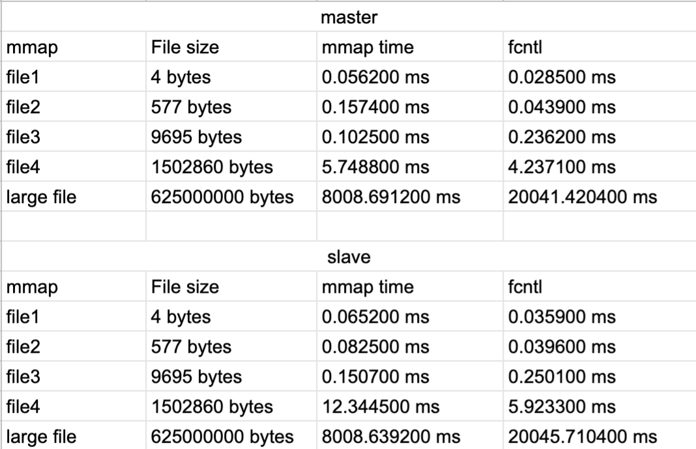

# OS Project2 Report

## Programming Design

The goal of this project is to compare two different method of implementing I/O, mmap and normal method. We use the file's fd(file descriptor) as the input of the mmap function, input the file size, and use virtual address to access the file.

#### master:

The master can know the size of the file in advance, so it can map the whole file onto virtual memory, thus access the file using virtual memory. By using this method, we don't need the buffer of normal file I/O. We can save the copy time, however mmap has some overhead.

#### slave:

The slave do not know the size of the file in advance, so we just use a fixed size in the beginning, nomally the multiple of page size. If the space runs out, create a new pages until the transmission ends. Note that the file we created is empty at first, so we need to write a null byte to it to avoid bus error when mmap. And we truncate the exceeded offset when the transmit end.

## Result

## Performance

Normal file I/O (read/write) takes less time than mmap when processing smaller data on both sides. But as the file size grows larger, the mmap method has the advantage. The time needed by the master and slave is similar when using normal file I/O, but when using mmap method, the slave takes a lot more time than the master. And the new number of pages mapped each time also affect the performance of mmap. If the number is larger, the performance is better because of less mapping time.

Using normal file I/O, the system will check if the page cache has the data or not. If no data is in it, copy the data into buffer. When using mmap, it will first cause page fault, then the system will save the corresponding page to the memory. When processing a larger file and access the pages near each other, page fault can be avoided significantly, so mmap is more effecient. And mmap don't need to copy data into buffer, so it will be faster.

On the other hand, if the file is small and do not need a lot of pages, the overhead of mmap (page fault) will be relatively large. So it will be slower.

So mmap should be used when we need to random access the file which is large.

##### conclusion

mmap is better when the file is large, normal file I/O is better when the file is small.

## Work List

b06902008: slave.c, compile, test

b06902014: report.md, compile, test

b06902031: slave.c, compile, test

b06902040: slave.c, compile, test

b06902124: master.c, compile, test

p06922005: shell scripts, compile, test
